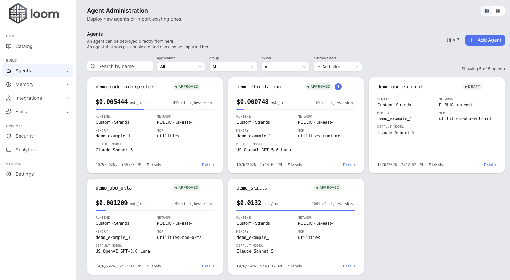
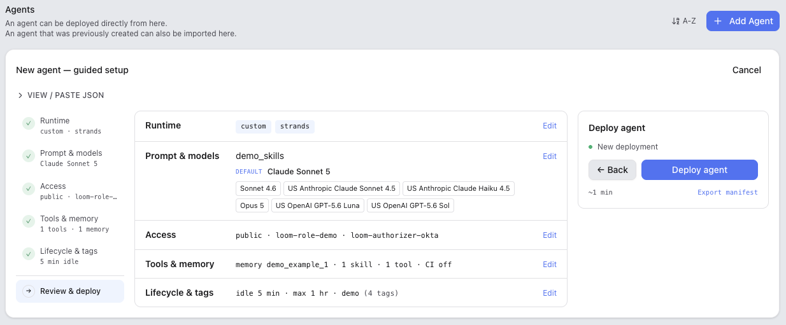
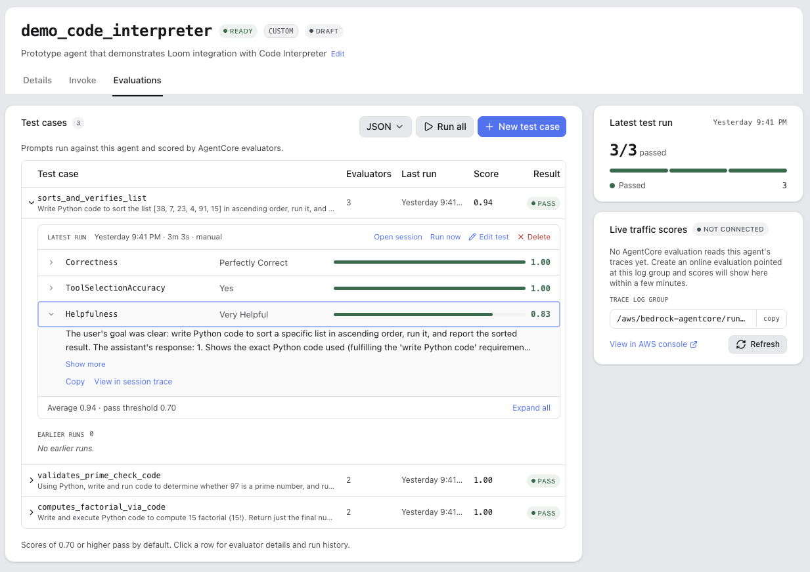
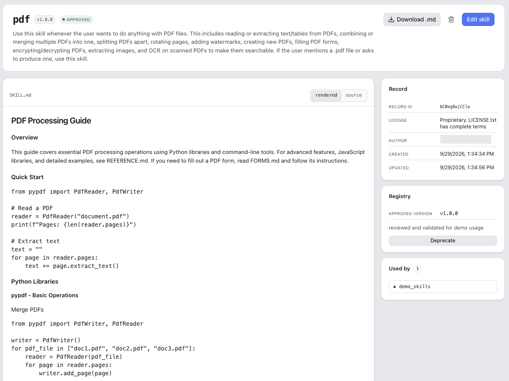
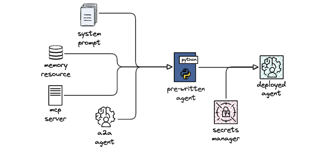
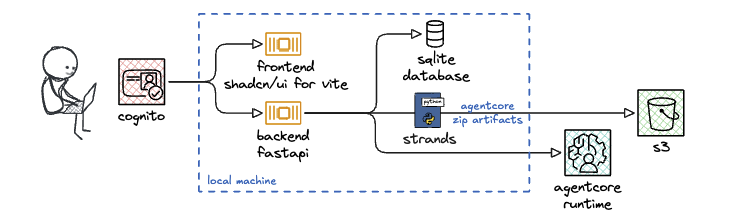
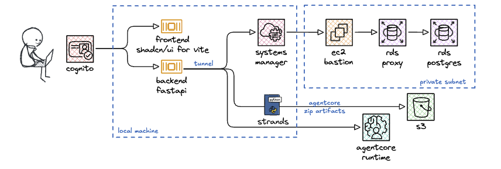
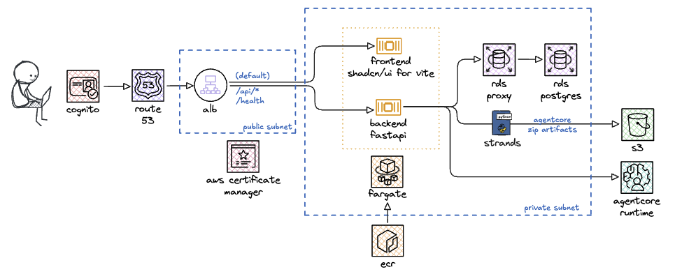

# Loom for AWS

[](https://github.com/awslabs/loom/stargazers)
[](https://github.com/awslabs/loom/network)
[](LICENSE)
[](https://github.com/awslabs/loom/releases)

**The management plane for AI agents on Amazon Bedrock AgentCore.** Deploy, govern, evaluate and cost-track agents across your whole organization from one place.

Amazon Bedrock AgentCore gives you excellent runtime primitives. Turning those primitives into a platform several teams can share is a different job, e.g., IAM execution roles, OAuth2 and on-behalf-of token exchange, credential providers, approval workflows, resource tagging, cost attribution, and observability. Loom owns that wiring so your teams can ship agents faster, knowing they implement security best practices and apply organizational guardrails.



## Why organizations use Loom

- **Ship agents in minutes, not sprints.** A guided wizard provisions the execution role, credential providers, log groups and tags for you. Bring your own code or deploy a fully managed agent through AgentCore harness with no code at all.
- **Run many teams in one deployment, safely.** Every resource is owned by a group via a `loom:group` tag, and a two-dimensional authorization model keeps teams to their own agents, memory, integrations and conversations.
- **Prove an agent works before it ships.** Author a prompt plus a selection of AgentCore's built-in evaluators as a test case, run it against the real agent, and gate on a pass/fail threshold with judge explanations and run history.
- **Govern what agents can reach.** Opt in to AWS Agent Registry so agents, MCP servers, A2A agents and skills need approval before use, plus human-in-the-loop approval policies for individual tool calls, with a queryable audit trail.
- **Know what it costs.** Per-invocation token counting and a cost dashboard with per-agent breakdown, so spend is attributable from day one rather than reconstructed later.
- **Keep your own identity provider.** Federate with Microsoft Entra ID, Okta, or any OIDC provider, and use on-behalf-of delegation (RFC 8693) so agents reach downstream systems with the *user's* permissions, not a shared service identity.
- **Start on your laptop, deploy when ready.** A three-phase model takes you from local SQLite, to a shared RDS database over an SSM tunnel, to the full stack on ECS Fargate.

**Who it's for:** platform and ML teams standardizing how agents get built and operated across an organization, especially where approvals, access boundaries, identity federation and cost attribution are hard requirements.

## A closer look

**Deploy an agent through a guided wizard.** Five steps behind a jumpable rail: runtime, prompt and models, access, tools and memory, lifecycle and tags with a review step that shows every resolved value before anything is created. Import a manifest by drag-and-drop, file picker, or pasted JSON, and export one back out.



**Evaluate agents on demand.** Test cases run against the live agent and are scored by AgentCore evaluators, with per-evaluator scores, judge explanations, and PASS/FAIL against a per-test-case threshold. Rescore an existing session without re-invoking the agent. Live-traffic scores from online evaluation configs appear alongside.



**Curate reusable skills with governance.** Author and version skill records, review the rendered SKILL.md or its source, track which agents use a skill, and move it through submit/approve/reject before anyone can attach it. Approved skills fold into an agent's system prompt at deploy time.



## Quick start

Run the whole UI locally with SQLite and no deployed compute. See [DEPLOYMENT.md](DEPLOYMENT.md) for prerequisites and the full guide.

```bash
git clone https://github.com/awslabs/loom.git && cd loom

# 1. Create the environment files, then fill in shared/etc/common.sh
#    (AWS profile, region, account, VPC/subnets, bucket names, passwords)
cp backend/etc/environment.sh.example backend/etc/environment.sh
cp frontend/etc/environment.sh.example frontend/etc/environment.sh
cp shared/etc/common.sh.example shared/etc/common.sh
cp shared/etc/environment.sh.example shared/etc/environment.sh
touch shared/etc/outputs.sh

# 2. Deploy a Cognito user pool with groups and scopes (~1 min)
cd shared && make cognito && make outputs && make cognito.set-passwords

# 3. Start the backend — SQLite by default, tables auto-created
cd ../backend && uv venv .venv && source .venv/bin/activate
make install && make run

# 4. Start the frontend (in a second terminal)
cd frontend && make install && make dev
```

Then open `http://localhost:5173` and sign in as the super admin or one of the demo users, using the passwords you set in `shared/etc/common.sh`.

## Features

Loom weaves together agents, memory, MCP servers, A2A agents, and skills in a unified platform.



| Area | What you get |
| --- | --- |
| **Agents** | Custom code (Strands or Google ADK) or no-code managed agents via AgentCore Harness; VPC egress and PrivateLink ingress; SSE streaming invocation; cold-start measurement |
| **Models** | Amazon Bedrock, or route per agent through a self-hosted LiteLLM proxy with automatically vended per-agent scoped keys |
| **Memory** | AgentCore Memory resources with semantic, summary, user-preference, episodic and custom strategies |
| **Integrations** | MCP servers with tool discovery, and A2A agents with automatic Agent Card fetching — both with OAuth2 and m2m/obo delegation |
| **Governance** | Opt-in AWS Agent Registry approvals, skills lifecycle, human-in-the-loop tool approval policies, audit trail |
| **Security** | Cognito or federated OIDC identity, group-based authorization across 22 scopes, OBO token exchange, IAM and credential management |
| **Quality** | On-demand agent evaluations with AgentCore evaluators, plus live-traffic evaluation results |
| **Operations** | OpenTelemetry traces with a waterfall timeline, per-agent cost dashboard, token counting, usage analytics |

<details>
<summary><strong>Full feature list</strong></summary>

### Agent Lifecycle
- Deploy new agents or import existing AgentCore Runtime agents
- Deploy managed agents via AgentCore harness (no code required) with configurable model parameters, built-in tools (code interpreter, browser), and MCP server integration
- **VPC-enabled agents:** deploy both custom and managed agents with VPC egress, configure subnets and security groups via named VPC config profiles for private access to VPC-internal resources
- Custom-code agent framework selection: Strands Agents (default) or Google Agent Development Kit (ADK), selectable per agent at deploy time with equivalent config schema, streaming event shapes, telemetry, and integration support
- SSE streaming invocation with real-time response display
- Progressive deployment status tracking and async deletion
- Cold-start latency measurement via CloudWatch log parsing
- Active session tracking with idle timeout heuristic
- External integration info: invocation URLs, auth requirements (SigV4/OAuth2), and copy-ready code snippets for connecting from outside Loom

### Alternate LLM Providers
- Route an agent's model calls through a self-hosted LiteLLM proxy instead of Amazon Bedrock, selectable per agent (custom or managed/harness deployments)
- Settings page connection management: enabled toggle, agent/discovery base URLs, write-only master key, live model catalog with per-provider enable/disable and a refresh button
- Per-agent scoped virtual keys vended automatically from the proxy, no shared credential is ever stored on an individual agent
- Dynamic model catalog merging curated static models with live Bedrock availability and the proxy's own reported models, so new proxy-side models appear without a Loom code change

### Memory Management
- Create and manage AgentCore Memory resources
- Configurable strategies: semantic, summary, user preference, episodic, custom

### MCP Servers
- Register and manage MCP servers with tool discovery
- OAuth2 authentication and credential provider support with delegation mode (M2M or OBO)
- Per-persona access control (all_tools or selected_tools)
- Resource export/edit system with pencil-to-edit and JSON export

### A2A Agents
- Register Agent-to-Agent protocol agents by base URL with automatic Agent Card fetching
- Structured Agent Card display: capabilities, authentication schemes, input/output modes, skills
- OAuth2 authentication with test connection
- Per-persona access control (all_skills or selected_skills)
- A2A runtime client with OAuth2 Bearer token injection via AgentCore Identity service
- Handles both SSE streaming and plain JSON responses with automatic method fallback
- Credential provider creation with exponential backoff retry for reliable deployment

### Agent Registry (Opt-In Governance)
- AWS Agent Registry integration for governance and discovery — opt-in via Settings page (ARN configuration)
- When enabled, provides additional governance: agents, MCP servers, and A2A agents must be approved before use
- Agents auto-registered in DRAFT status on deployment; admins manage approval workflow
- Full record lifecycle: create, submit for approval, approve, reject, delete
- Descriptor builders for agents, MCP servers, and A2A agents
- Semantic search over registry records via data plane API
- Visibility filtering: end-users see only APPROVED or unregistered resources
- Integration gating: only APPROVED MCP servers and A2A agents can be selected for agent deployments
- Skills: author, edit, and delete SKILL records directly from the Skills page (registry:write), with governance (submit/approve/reject) and read-only browsing (registry:read) for everyone else; also listed in the Platform Catalog. Approved skills can be attached to an agent at creation time or afterward, folding their SKILL.md content into that agent's system prompt on deploy/redeploy

### Security and Access Control
- Cognito user authentication with automatic token refresh
- 3rd-party identity provider support: federate with Microsoft Entra ID, Okta, Auth0, or any Generic OIDC provider via Authorization Code + PKCE flow, with configurable group claim mapping to Loom groups and client_type (public/confidential) toggle
- Two-dimensional group-based authorization: Type groups (t-admin, t-user) for UI view and Resource groups (g-admins-*, g-users-*) for access control (22 scopes total)
- IAM role, authorizer, and credential management
- Admin user view switching to preview scoped experiences
- Human-in-the-loop (HITL) approval policies: configurable policies for tool-level human oversight with four methods — agentic loop hooks, tool context interrupts, MCP elicitation, and harness inline functions
- Approval audit trail with per-agent queryable log
- On-behalf-of (OBO) token exchange: RFC 8693 delegation enabling agents to access downstream resources with user-scoped permissions, configurable per MCP server and A2A agent via delegation_mode (m2m/obo) with support for TOKEN_EXCHANGE and JWT_AUTHORIZATION_GRANT flows
- Token info inspection card showing decoded OBO token claims with group mapping resolution
- Per-user session ownership filtering in admin invoke panel

### Platform Catalog and Tagging
- Unified catalog view across agents, memory, MCP servers, and platform resources
- Configurable tag policies (platform + custom) and named tag profiles
- Tag badges with filtering and persistent state

### Token Usage and Cost Tracking
- Per-invocation token counting via Bedrock CountTokens API (Anthropic/Meta models) with 4 chars/token heuristic fallback
- Cost dashboard with time-range selector and per-agent breakdown
- Cost badges on agent cards, token/cost columns in invocation tables
- Model pricing metadata for all supported Anthropic and Amazon models

### Analytics
- Platform usage analytics for super-admins ("User Activity" tab, alongside a "Costs" tab): login tracking, user action tracking, and page navigation tracking
- All audit events are scoped to a browser session UUID (generated at login, stored in React state) to distinguish shared accounts
- Global multi-select user filter that limits all summary cards, charts, and tab tables to selected users; stats are recomputed client-side from filtered data when active
- Summary cards (total logins, total page views, total actions, total duration, most active page) with time-range selector
- Charts: logins over time, actions over time, page views by page (recharts)
- Per-session drill-down: interleaved timeline of logins, actions, and page views for any browser session
- 27 instrumented action types across agent, memory, security, tagging, MCP, and A2A categories

### Observability and UX
- OpenTelemetry observability with ADOT auto-instrumentation and OTEL trace visualization
- Interactive waterfall timeline for inspecting per-span events from OTEL log records
- Agent evaluations (Evaluations tab): save a prompt plus a selection of AgentCore's built-in evaluators as a test case, run it to invoke the agent for real and score that session on demand, and review per-evaluator scores with judge explanations, PASS/FAIL against a per-test-case threshold, and run history. Re-score an existing session without re-invoking the agent
- Live-traffic evaluation results per agent: online evaluation configs and batch evaluation runs that score the agent, when each last ran, and every evaluated session with its scores, judge explanations, and the prompt and answer
- Card/table view toggle on all listing pages
- Estimated cost column in agent and memory table views; consistent 5-column layout for MCP and A2A tables
- Drag-to-reorder cards with persistent ordering
- JSON import/export on deploy and create forms
- Two themes (light, dark) with WCAG AA contrast compliance, and timezone-aware timestamps

</details>

## Project Structure

```
loom/
├── agents/            # Agent blueprint source code (Strands Agent, Google ADK)
├── backend/           # FastAPI backend (Python, SQLAlchemy, boto3)
│   ├── etc/           # Backend environment config (app + ECS backend service)
│   └── iac/           # Backend infrastructure (RDS, EC2 bastion, ECS backend service)
├── frontend/          # React/TypeScript frontend (Vite, shadcn, Tailwind CSS)
│   ├── etc/           # Frontend environment config (ECS frontend service)
│   └── iac/           # Frontend infrastructure (ECS frontend service)
├── shared/            # Shared IaC (IAM roles, Cognito, DNS, infra, ECS cluster) + deployment makefile
│   └── etc/           # Shared environment config (Cognito, infra, DNS)
└── SPECIFICATIONS.md  # Project-level specification
```

See [`backend/SPECIFICATIONS.md`](backend/SPECIFICATIONS.md) and [`frontend/SPECIFICATIONS.md`](frontend/SPECIFICATIONS.md) for detailed component specifications.

## Architecture

- **Backend:** FastAPI with SQLAlchemy (SQLite for local dev, PostgreSQL/RDS for cloud), boto3 for AWS, SSE streaming via `StreamingResponse`
- **Infrastructure:** SAM templates — shared (DNS, S3, ECR, ACM, ALB, ECS cluster) in `shared/iac/`, frontend ECS service in `frontend/iac/`, backend (RDS, EC2 bastion, ECS service) in `backend/iac/`
- **Containers:** Dockerfiles for both frontend (multi-stage Node + nginx) and backend (Python 3.13 slim + uvicorn + agent source from repo root), deployable to ECS Fargate behind an ALB with ACM certificate
- **Frontend:** React 18, TypeScript, Vite, shadcn/ui, Tailwind CSS v4
- **Auth:** Cognito User Pool with group-based scopes; frontend enforces sidebar visibility and write permissions
- **Navigation:** Platform Catalog, Agents, Memory, Integrations (MCP Servers/A2A Agents tabs), Security Admin, Settings (with a Tagging tab), Analytics (User Activity/Costs tabs, super-admins only) — grouped under Home/Build/Operate/System sidebar sections

## Deployment

Loom supports a progressive deployment model with three phases:

### Phase 1: Local Testing with Cognito

Develop and test the full Loom UI locally with SQLite (zero-config database) and Cognito authentication.  
**What you can do:** Deploy and invoke agents, manage memory and MCP servers, iterate quickly with hot-reload on both frontend and backend — all without deploying any compute infrastructure to AWS.



### Phase 2: Hybrid Deployment with RDS

Deploy RDS PostgreSQL to AWS and connect via SSM tunnel while still developing locally.  
 **What you can do:** Test with production-grade PostgreSQL, share a centralized database across team members, validate data persistence and migration strategies, and prepare for full cloud deployment — all while maintaining fast local iteration cycles.



### Phase 3: Full Deployment to AWS

Deploy the entire stack (frontend, backend, database) to AWS ECS Fargate behind an Application Load Balancer.  
**What you can do:** Run Loom as a production-ready, fully managed service accessible via HTTPS with custom domain, enable your team to access Loom from anywhere without local setup, leverage auto-scaling for the backend, and operate with enterprise-grade security, observability, and high availability.



See [DEPLOYMENT.md](DEPLOYMENT.md) for detailed deployment instructions.

## Disclaimer

Loom is provided as open source software to accelerate agent development. It is offered "as-is" without warranties or service level agreements. Users are responsible for conducting their own security reviews, dependency audits, and testing before deploying in production, and for keeping installations up-to-date. Breaking changes may occur between releases. While community contributions are welcome, there is no guarantee of support response times, and long-term roadmap decisions remain with the maintainers. Organizations with strict compliance or regulatory requirements should evaluate whether the project's licensing and governance model align with their internal policies.

## License

This project is licensed under the Apache License, Version 2.0. You may obtain a copy of the License at <http://www.apache.org/licenses/LICENSE-2.0>.

Unless required by applicable law or agreed to in writing, software distributed under the License is distributed on an "AS IS" BASIS, WITHOUT WARRANTIES OR CONDITIONS OF ANY KIND, either express or implied. See the [LICENSE](LICENSE) file for the full terms and conditions.
