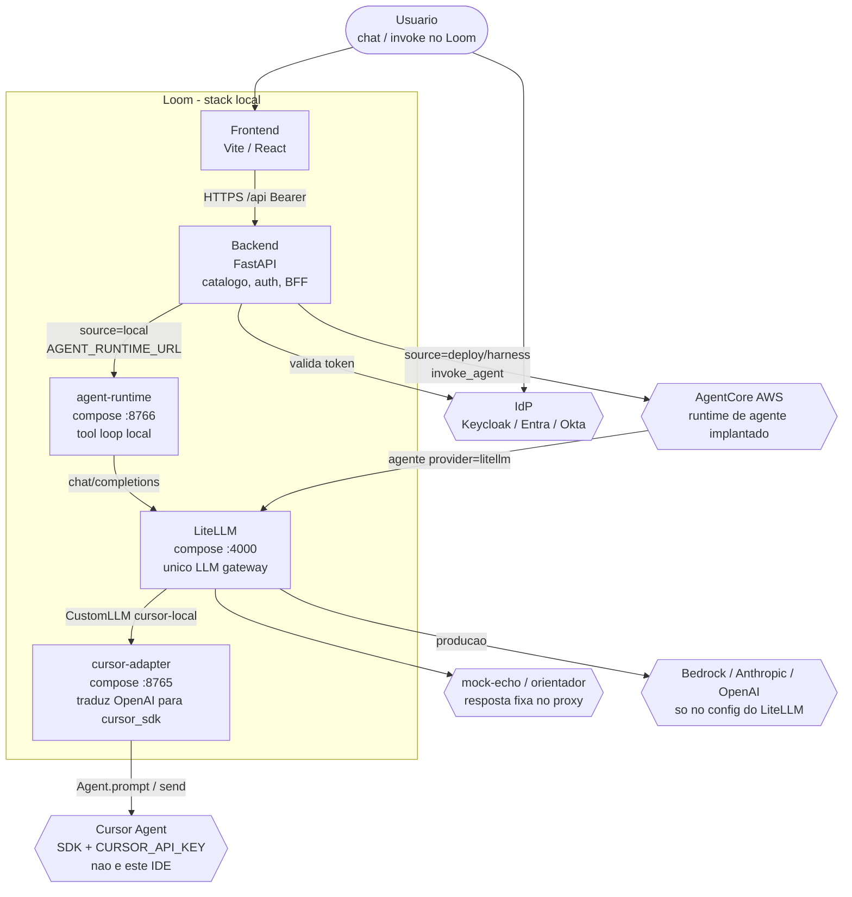
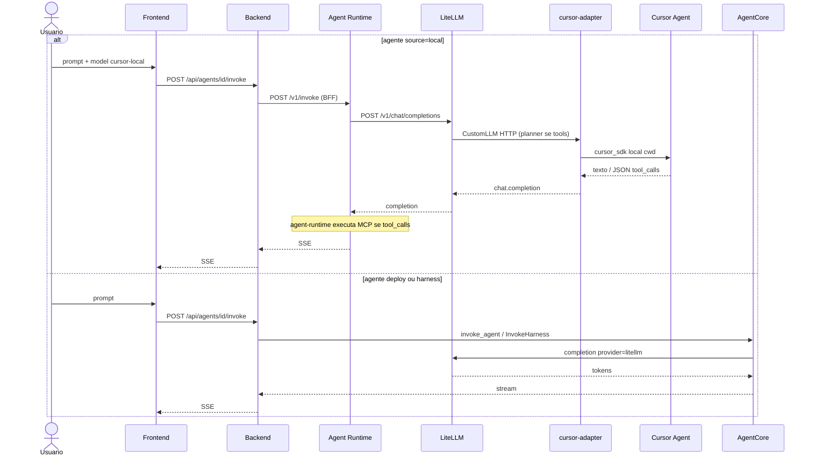

# 3. Usar o LiteLLM como único gateway de LLM do Loom

- **Status:** Aceita
- **Data:** 2026-09-12
- **Decisores:** Mantenedores da plataforma
- **Relacionada a:** [ADR 0002 — PostgreSQL](0002-postgresql-as-relational-datastore.md), [ADR 0005 — Local Agent Runtime](0005-local-agent-runtime.md), [Spec 002 — stack local](../specs/002-local-docker-compose-stack.md)

## Contexto

O Loom já é um *agent runtime* e um *control plane*: registra, implanta e invoca agentes no Amazon Bedrock AgentCore, orquestra MCP/A2A, e deriva autorização de grupos. A inferência de modelo, hoje, está acoplada em dois lugares distintos:

1. **Catálogo e formulário.** `backend/etc/providers.json` declara `bedrock` (padrão) e `litellm` (opcional). `GET /api/agents/models` lista Bedrock; `GET /api/agents/models/litellm` lista o proxy. O frontend (`frontend/src/lib/models.ts`) ordena Bedrock primeiro.
2. **Construção do cliente no artefato do agente.** `agents/strands_agent` e `agents/adk_agent` fazem *dispatch* por `config.provider`: `bedrock` usa IAM/`BedrockModel`; `openai`/`anthropic`/`litellm` usam chave + `base_url`. O ADK, inclusive, já roteia Bedrock por `LiteLlm(model="bedrock/...")` — um SDK LiteLLM *dentro do agente*, não o proxy.

O proxy LiteLLM **já existe como integração de primeira classe** (`backend/app/services/litellm.py`): duas URLs (`LOOM_LITELLM_PROXY_BASE_URL` para o agente, `LOOM_LITELLM_DISCOVERY_BASE_URL` para o backend), master key, *virtual keys* por agente (`POST /key/generate`), e Settings → Models. O que *não* existe é (a) o proxy no `docker-compose.yml` local, (b) a política de que o Loom só conhece LiteLLM, e (c) um backend local de desenvolvimento (Cursor) atrás desse proxy.

O invoke (`POST /api/agents/{id}/invoke`) **não chama o LLM**. Ele chama o AgentCore (`invoke_agent` / `InvokeHarness`). Trocar o gateway de modelo não substitui o AgentCore e não cria um segundo runtime.

Queremos, sem reescrever o Loom:

- trocar provider/modelo, fallback, roteamento e rate limit no LiteLLM;
- credenciais de Anthropic/OpenAI/Bedrock *fora* do processo do Loom;
- um ambiente local em que o desenvolvedor use o Cursor instalado na máquina, sem o Loom importar o Cursor SDK;
- produção que troca Cursor por Bedrock/Anthropic/OpenAI alterando só o `config.yaml` do LiteLLM.

## Decisão

O contrato oficial de inferência do Loom passa a ser:

```text
Loom (control plane + agent runtime no AgentCore)
        │  OpenAI-compatible (via provider=litellm)
        ▼
LiteLLM (único LLM gateway)
        │
        ├── Bedrock / Anthropic / OpenAI / …   (produção)
        └── CustomLLM → serviço cursor-adapter → Cursor SDK / Bridge → Cursor Agent
              (somente desenvolvimento local)
```

Princípios:

1. **O Loom é agent runtime e control plane.** Continua implantando e invocando no AgentCore. Não vira um cliente de completion.
2. **O LiteLLM é o LLM gateway.** Roteamento, fallback, custo, rate limit e credenciais de provider final vivem nele.
3. **Providers finais são responsabilidade do LiteLLM.** O registro `providers.json` deixa de crescer com Anthropic/OpenAI/Cursor.
4. **O Loom não guarda credenciais de provider final.** Só a master key (ou virtual key) do proxy. Convenção já existente: `LOOM_LITELLM_PROXY_API_KEY` / `loom/settings/litellm-master-key`.
5. **Cursor não é um LLM provider tradicional.** É um *agent backend* local (sessão, tools, filesystem, MCP, permissões).
6. **Cursor só entra atrás de um CustomLLM do LiteLLM**, nunca como `provider` no Loom nem como import no backend.
7. **A implementação local não contamina produção.** O modelo `cursor-local` existe só no `config.yaml` do compose; IaC de produção não o referencia.
8. **Trocar Cursor por Bedrock/Anthropic/OpenAI não altera o Loom** — altera o model_list do LiteLLM.
9. **O contrato Loom ↔ LiteLLM é OpenAI-compatible** (`/v1/chat/completions`, `/model/info`, `/key/generate`), que o código já usa.
10. **Novos backends de inferência** (Google, Azure, outro CustomLLM) entram só no LiteLLM.

As variáveis **já existentes** são a fonte de verdade. Não inventar `LITELLM_BASE_URL`:

| Papel | Variável existente |
| --- | --- |
| URL que o agente/harness usa em runtime | `LOOM_LITELLM_PROXY_BASE_URL` |
| URL que o backend usa para discovery/keys | `LOOM_LITELLM_DISCOVERY_BASE_URL` |
| Master key do proxy | `LOOM_LITELLM_PROXY_API_KEY` |

No compose local, discovery aponta para `http://litellm:4000` (rede Docker) e a URL do agente, quando visível no browser/host, para `http://localhost:4000` — a mesma dualidade issuer/JWKS da spec 001.

### Como funciona (C4 nível 2)

Nível 2 = **containers**. O LiteLLM é o único gateway de modelo. Cursor não é
container do Loom: o `cursor-adapter` fala com a API/SDK do Cursor. AgentCore
continua sendo o runtime de agente implantado na AWS. No compose, o invoke
`source=local` passa pelo **agent-runtime** (ADR 0005), que é quem chama o
LiteLLM — o FastAPI só faz BFF SSE.

C4 L2 em Mermaid portátil (`flowchart`; o dialeto `C4Container` quase não
renderiza no preview).



Dois caminhos de invoke (o LiteLLM é o mesmo; quem chama muda):



O backend **não** importa `cursor_sdk`. `CURSOR_API_KEY` vive só no
`cursor-adapter`. Master key do proxy (`LOOM_LITELLM_PROXY_API_KEY`) é a
única credencial de LLM que o Loom guarda.

## Alternativas consideradas

| Opção | Vantagem | Desvantagem | Por que não |
| --- | --- | --- | --- |
| Loom → Bedrock direto | Já funciona; IAM nativo; zero hop | Acopla catálogo, IAM e cliente ao Bedrock; sem fallback/multicloud | Continua como *backend do LiteLLM* em produção, não como contrato do Loom |
| Loom → Anthropic / OpenAI direto | SDK simples | Credenciais no Loom; o ADK/Strands já têm esses ramos e devem ser descontinuados | Viola o desacoplamento |
| Loom → LiteLLM → provider | Já parcialmente implementado; OpenAI-compatible; virtual keys | Hop extra; o proxy vira dependência de disponibilidade | **Escolhida.** Completa o que o código já começou |
| Loom → Cursor direto | Menos componentes locais | Acopla o backend ao SDK; Cursor não é completion; quebra produção | Explicitamente proibido |
| Loom → LiteLLM → CustomLLM Cursor | Loom não conhece Cursor; DEV/PROD trocam no proxy | Adapter + Bridge no host; Cursor não cabe bem em container | **Escolhida para DEV local** |

## Consequências

- **Componente novo no compose:** serviço `litellm` (e, no perfil `cursor`, o processo adapter no *host*). Complexidade operacional local sobe; o backend do Loom não ganha um cliente novo.
- **Latência:** um hop HTTP a mais no caminho do modelo. Irrelevante frente ao AgentCore e ao loop do Cursor.
- **Disponibilidade:** se o proxy cai, agentes `provider=litellm` falham. Mitigação: healthcheck no compose; em produção, o mesmo padrão de ALB já previsto no IaC (`pLitellmProxyBaseUrl`).
- **Segurança / credenciais:** master key local descartável no compose; chaves de Anthropic/OpenAI/Bedrock e `CURSOR_API_KEY` só em `.env` (gitignored). O Loom continua sem elas.
- **Observabilidade:** LiteLLM já emite spend/logs; o adapter registra `session_id`, `workspace`, duração e falha — nunca a API key nem o prompt completo por padrão.
- **Debugging local:** falha de catálogo (`/model/info`) é do proxy; falha de invoke continua sendo AgentCore (AWS). O Cursor só entra quando alguém chama o modelo `cursor-local` no proxy.
- **AgentCore não some.** Deploy, memória, invoke SSE e IAM permanecem. O que muda é *quem o agente chama para completar tokens*.
- **Cursor no host, não no container.** O agente do Cursor precisa do workspace, git, terminal, MCP e credenciais do desenvolvedor. Colocá-lo no Docker isola exatamente o que o DEV precisa.
- **Limitação do Cursor local:** não é um modelo de completion estável; sessões são in-memory no POC; resume de processo não é garantido; MCP inline não sobrevive a `Agent.resume` sem ser passado de novo.

## DEV vs PROD

```text
DEV:   Loom → LiteLLM (compose) → mock-echo
                               → cursor-local → adapter host → Cursor Agent
PROD:  Loom → LiteLLM (ALB)    → bedrock/* | anthropic/* | openai/*
```

O Loom, em ambos, tem `provider=litellm` e as três variáveis `LOOM_LITELLM_*`.
