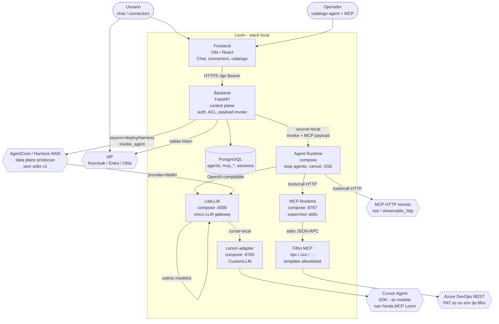
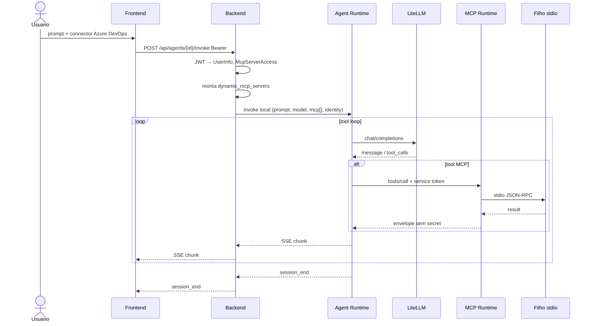

# 5. Runtime de agente local com paridade de invoke ao AgentCore

- **Status:** Proposta (não implementar até validar specs de acompanhamento)
- **Data:** 2026-09-13
- **Decisores:** Mantenedores da plataforma
- **Relacionada a:**
  [ADR 0003 — LiteLLM](0003-litellm-as-llm-gateway.md),
  [ADR 0004 — Local MCP Runtime](0004-local-mcp-runtime.md),
  [ADR 0001 — IdP](0001-keycloak-as-identity-provider.md),
  [ADR 0006 — Extensão local-runtime](0006-local-runtime-extension-repo.md)

## Problema

O ADR 0003 estabelece que o invoke do Loom **não chama o LLM**: chama o
AgentCore (`invoke_agent` / `InvokeHarness`). O LiteLLM é só gateway de
modelo. O ADR 0004 coloca MCP stdio atrás de um runtime separado
(`mcp-runtime`), não no FastAPI.

O caminho `source=local` (ex.: Orientador Acadêmico) quebra esses
invariantes na prática:

```text
Chat → Backend (uvicorn) → LiteLLM → texto
```

Consequências observadas:

1. **O backend é o agent runtime.** Crash, timeout ou loop longo competem
   com a API de catálogo/auth.
2. **Sem MCP.** O invoke resolve `dynamic_mcp_servers` (incluindo stdio
   para agentes locais), mas `invoke_local_agent_stream` **descarta** esse
   payload. O operador marca o connector Azure DevOps e o modelo responde
   que não tem acesso a tools — corretamente.
3. **Sem paridade.** Memory, A2A, elicitation, approvals e OBO/M2M existem
   (ou entram) no path AgentCore/harness; local é um cliente de completion.
4. **`cursor-local` não é runtime.** É modelo atrás do LiteLLM (ADR 0003).
   O Cursor Agent do adapter não herda o catálogo MCP do Loom.

Queremos agentes locais que usem **os mesmos recursos do Loom** (conectores
MCP do catálogo, ACL `McpServerAccess`, sessão/SSE do Chat) **como se**
estivessem no AgentCore — no compose, sem AWS — sem voltar a hospedar o
loop do agente no processo do FastAPI.

Restrições:

- não enfraquecer `net_guard` nem o bypass fail-closed de auth em loopback;
- não fazer o FastAPI `Popen` de agentes ou de MCP;
- LiteLLM continua o único LLM gateway (ADR 0003);
- MCP stdio continua só no `mcp-runtime` (ADR 0004); AgentCore na AWS
  continua **sem** stdio no deploy;
- não inventar um segundo catálogo de agentes ou de MCP;
- IdP-agnóstico: o runtime local não valida JWT do usuário.

## Decisão

Introduzir um **Local Agent Runtime** (`agent-runtime`) como *data plane*
local, espelho do papel do AgentCore no laptop:

```text
Loom control plane (FastAPI)
        │  mesmo contrato de invoke (prompt, sessão, modelo, MCP, identity)
        ▼
Local Agent Runtime          ← loop do agente, cancel, isolamento
        ├── LiteLLM                 (só completion / chat)
        └── MCP (HTTP do catálogo + fachada mcp-runtime para stdio)
```

Princípios:

1. **O Loom volta a ser só control plane no caminho local.** Auth, catálogo,
   `McpServerAccess`, montagem do payload e SSE para o browser. Não executa
   o tool loop.
2. **Um contrato de invoke.** O payload que hoje alimenta AgentCore/harness
   (`dynamic_mcp_servers`, `model_id`, `session_id`, identity, policies)
   é o mesmo shape (subconjunto versionado) enviado ao `agent-runtime`.
   Adaptadores: `agentcore | harness | local`.
3. **O agent-runtime é processo/serviço separado** (compose `:8766` ou
   porta acordada; bind loopback / rede Docker). Sessões isoladas
   (processo ou container por sessão na v1 mínima; pool com hard limit
   depois).
4. **Modelo só via LiteLLM.** O runtime não importa Bedrock/Anthropic/
   Cursor SDK. `cursor-local` continua CustomLLM no proxy.
5. **Tools só via MCP do payload.** HTTP remoto do catálogo e
   `http://mcp-runtime:8787/s/{id}/mcp` para stdio. Sem SDK Azure/GitHub
   no agent-runtime.
6. **Authz no control plane; runtime fail-closed.** O backend já filtrou
   connectors e `allowed_tools`. O runtime e o `mcp-runtime` ainda
   respeitam allowlist / token de serviço. O filho MCP não recebe JWT.
7. **SSE compatível com o Chat.** `session_start`, `chunk`, `session_end`,
   `error` — a UI não bifurca por `source=local`.
8. **Maturidade por fases** (abaixo). M1+M2 = “interessante”; M3+ = ricos.

### Como funciona (C4 nível 2)

Nível 2 = **containers** (processos implantáveis), não classes. O sistema
é o stack local do Loom. AgentCore na AWS permanece o data plane de
produção; local não o substitui — **espelha o contrato**.

C4 L2 em Mermaid portátil (`flowchart`; o dialeto `C4Container` quase não
renderiza no preview do GitHub/Cursor).



Fluxo de um invoke local com connector stdio (o Chat não fala com o
`npx`; o FastAPI não faz o tool loop):



### Contrato mínimo de invoke (v1)

O backend já monta a maior parte disto para AgentCore/harness. O
`agent-runtime` consome o **mesmo subconjunto**:

| Campo | Uso |
| --- | --- |
| `prompt` / mensagens | entrada do usuário (+ system do agente local) |
| `session_id` / `invocation_id` | correlação SSE e logs |
| `model_id` | enviado ao LiteLLM |
| `mcp_servers[]` | `name`, `endpoint_url`, `transport`, `allowed_tools`, auth de serviço |
| `identity` | `subject`, `agent_id`, `session_id` (headers para mcp-runtime) |
| `approval_policies` | opcional; M3 |

Autenticação backend → agent-runtime: token de serviço (padrão
`MCP_RUNTIME_TOKEN` / `AGENT_RUNTIME_TOKEN`), não o JWT do usuário.
Loopback / rede compose apenas.

### Fases de maturidade

| Fase | Entrega | Critério de aceite |
| --- | --- | --- |
| **M0** | ADR + specs do contrato | Payload versionado; adapters nomeados |
| **M1** | `agent-runtime` + LiteLLM + MCP | Orientador + Azure DevOps stdio no Chat; crash do agente não derruba o FastAPI |
| **M2** | Paridade de plataforma | Connectors da UI, `McpServerAccess`, SSE idêntico, telemetria de tools |
| **M3** | Recursos ricos | Cancel/reconnect; approvals; memory/A2A/elicitation/OBO conforme necessidade |
| **M4** | Operação | Limites de sessão, health, opcional fila/Temporal; AgentCore Dev como backend alternativo **se** estável |

**Maturidade interessante** = **M1 + M2**. Não exige clonar a AWS.

### Alcance da v1

- Só agentes `source=local` no compose.
- AgentCore/harness na AWS inalterados; stdio continua proibido no deploy.
- Um framework de agente allowlisted no `agent-runtime` (Strands **ou** ADK
  **ou** loop OpenAI-tools — escolher nas specs; não os três na v1).
- `cursor-local` permanece modelo, não runtime de tools do Loom.

## Alternativas consideradas

| # | Ideia | Veredito |
| --- | --- | --- |
| 1 | Ensinar `local_invoke` no uvicorn a chamar MCP | **Rejeitada.** Mantém o agente no processo do Loom; afasta da paridade AgentCore; piora isolamento. |
| 2 | Tratar Cursor IDE / `cursor-local` como runtime Loom | **Rejeitada.** Cursor não recebe o catálogo/ACL do Loom; mistura trust boundary; ADR 0003 já o posiciona como modelo. |
| 3 | Local Agent Runtime com contrato de invoke espelhado | **Escolhida.** Data plane local; control plane fino; reusa mcp-runtime e LiteLLM. |
| 4 | Fila + workers (Celery/arq) sem runtime de agente | **Complementar depois.** Resolve escala de jobs; não define sozinho tool loop + SSE + MCP. |
| 5 | Temporal / workflows duráveis | **Adiada (M4).** Excelente para multi-minuto; overkill antes de M1/M2. |
| 6 | Esperar “AgentCore local” oficial da AWS | **Não bloquear M1.** Pode virar adapter em M4 se o contrato local já existir. |
| 7 | Segundo catálogo de agentes “local-only” | **Rejeitada.** `source=local` no catálogo atual basta. |

## Consequências

- `invoke_local_agent_stream` deixa de falar com o LiteLLM diretamente;
  passa a ser cliente HTTP/SSE do `agent-runtime` (ou é substituído por
  um `AgentRuntimeClient` compartilhado).
- Novo serviço compose + variáveis (`AGENT_RUNTIME_URL`, token de serviço).
- Specs novas (contrato, segurança, observabilidade, aceite Orientador+ADO).
- O Chat deixa de mentir para o usuário: connectors habilitados passam a
  ter efeito em agentes locais.
- Custo operacional: mais um container saudável no `make local.up`.
- Documentação: ADR 0003 ganha nota de que o *atalho* local atual é
  transitório até este runtime.

## O que não fazer

- Implementar o tool loop dentro de `backend/app/services/local_invoke.py`.
- Fazer o `agent-runtime` validar JWT do IdP ou falar com Keycloak.
- Expor a porta do agent-runtime em `0.0.0.0` sem restrição.
- Permitir stdio MCP em snapshots de deploy AgentCore “porque local já tem”.
- Importar `@azure-devops/mcp` ou Cursor SDK no agent-runtime.
- Implementar antes das specs de acompanhamento serem aceitas.

## Specs de acompanhamento

Bloqueiam implementação até aceites em rascunho/revisão:

1. [011 — Contrato de invoke](../specs/011-local-agent-runtime-contract.md)
2. [012 — Segurança](../specs/012-local-agent-runtime-security.md)
3. [013 — Observabilidade](../specs/013-local-agent-runtime-observability.md)
4. [014 — Aceite Orientador + ADO](../specs/014-local-agent-orientador-ado-acceptance.md)
