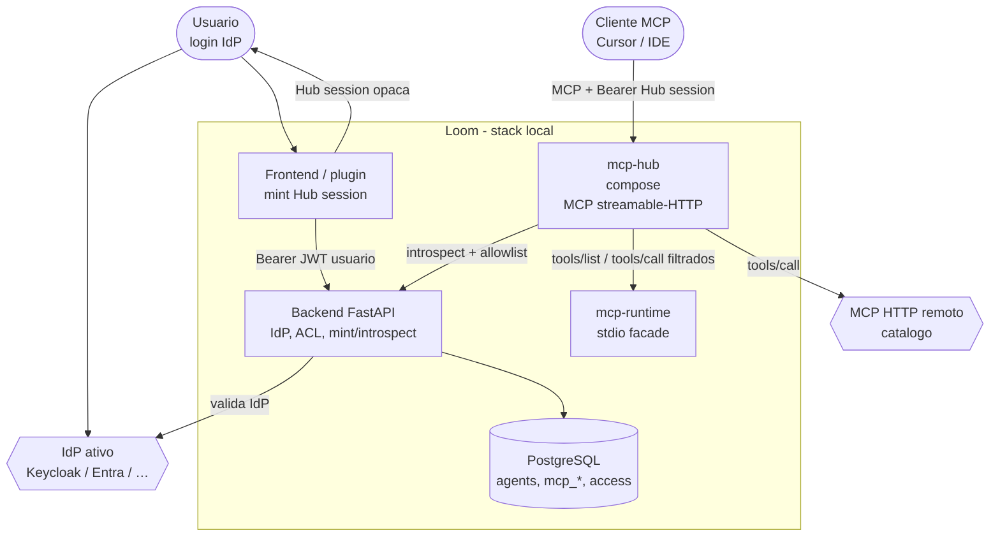

# 7. MCP Hub (Fase 1) — tools MCP governadas pelo Loom

- **Status:** Proposta (Fase 1: só tools; agents fora de escopo)
- **Data:** 2026-09-13
- **Decisores:** Mantenedores da plataforma / extensão local
- **Relacionada a:**
  [ADR 0001 — IdP](0001-keycloak-as-identity-provider.md),
  [ADR 0004 — Local MCP Runtime](0004-local-mcp-runtime.md),
  [ADR 0005 — Local Agent Runtime](0005-local-agent-runtime.md),
  [ADR 0006 — Extensão local-runtime](0006-local-runtime-extension-repo.md),
  [Spec 015 — Grafana/Rancher stdio](../specs/015-grafana-rancher-mcp-stdio.md)

## Problema

Clientes MCP externos (Cursor, Claude Desktop, IDEs) precisam de **um**
endpoint MCP que exponha apenas as tools que a **conta logada** pode usar,
segundo o control plane do Loom (IdP + RBAC + catálogo + `McpServerAccess`).

Hoje:

- o Chat/invoke já filtra conectores e tools por agente;
- não há fachada MCP **orientada ao usuário** para o IDE;
- ACL de MCP é **agent-centric** (`persona_id` → servidor → tools), não
  “user → tools” direto;
- validar JWT do IdP no data plane viola ADR 0004/0005.

Queremos um **MCP Hub** na extensão `local-runtime` que:

1. exija autenticação via IdP ativo do Loom;
2. disponibilize só tools MCP permitidas à conta;
3. **não** invoque agents nesta fase (Fase 2);
4. não crie segundo catálogo MCP;
5. não prefixe tools com `loom_`.

## Decisão

### Fase 1 (esta ADR)

Introduzir o serviço **`mcp-hub`** no `local-runtime` como *fachada MCP
user-facing*, com o Loom como única autoridade de identidade e autorização.

```text
Cliente MCP (Cursor / IDE)
    │  streamable HTTP + Bearer (Hub session)
    ▼
mcp-hub  (local-runtime, data plane)
    │  resolve allowlist / proxy tools/call
    │  NÃO valida JWT do IdP
    ▼
Loom FastAPI (control plane)
    │  IdP, mint/introspect Hub session, McpServerAccess, catálogo
    ▼
mcp-runtime / MCP HTTP remotos  (já existentes)
```

### Princípios

1. **Um catálogo.** O Hub não cadastra servidores. Lê o catálogo Loom e
   encaminha para as fachadas já existentes (`stdio` via mcp-runtime,
   `sse` / `streamable_http` remotos).
2. **Login = IdP do Loom.** O usuário autentica no control plane (fluxo
   browser / device). O Hub **nunca** fala com Keycloak/Entra/Okta.
3. **Hub session opaca.** Após login, o Loom emite um token de sessão Hub
   (TTL, `sub`, escopos mínimos, binding opcional a client_id). O cliente
   MCP usa esse Bearer. O Hub introspecta/valida a sessão **só** via API
   Loom (ou cache assinado pelo Loom).
4. **Autorização (Fase 1 interina):** união de agents invocáveis.
   **Default duradouro:** [ADR 0008](0008-mcp-hub-clients.md) — MCP Client
   **descoberto** no `initialize` (`clientInfo`); admin enable+grants na
   extensão; mint só autentica o user. Ver também [ADR 0009](0009-mcp-hub-client-identification.md).
5. **Só tools MCP.** Sem `list_agents` / `invoke_agent` / A2A nesta fase.
6. **Nomes sem prefixo de produto.** Tools do Hub não usam prefixo `loom_`.
   Em colisão entre servidores, namespacar pelo **servidor/template**
   (`grafana_…`, `azure-devops_…`), não por `loom_`.
7. **Extensão ADR 0006.** Código e compose em `local-runtime/services/mcp-hub`;
   UI mínima (URL do Hub, mint de sessão) no plugin. Ganchos no core só
   para mint/introspect + leitura de ACL (BFF).
8. **Fail-closed.** Sessão expirada / sem ACL → `tools/list` vazio ou
   erro de auth; `tools/call` fora da allowlist → 403 (igual mcp-runtime).

### Como funciona (C4 nível 2)



### Fluxo de sessão (Fase 1)

1. Usuário autentica no Loom (IdP).
2. UI/plugin (ou endpoint BFF) chama `POST /api/…/hub/sessions` com JWT
   do usuário → recebe `hub_session_token` + `mcp_hub_url` + `expires_at`.
3. Cliente MCP configura URL do Hub + Bearer = Hub session.
4. `initialize` / `tools/list`: Hub pede allowlist ao Loom (ou usa snapshot
   assinado na sessão); agrega tools dos servidores permitidos.
5. `tools/call`: Hub verifica nome ∈ allowlist; encaminha ao endpoint
   interno do servidor (mcp-runtime ou remoto) com identidade de serviço
   + `X-Loom-Allowed-Tools` / headers de IdentityContext já usados hoje.
6. Expiração / logout: introspect falha → Hub recusa.

### Fora de escopo (Fase 1)

- Invocar agents Loom via Hub (Fase 2 — tool MCP ou A2A/API).
- Segundo catálogo MCP ou templates no Hub.
- Validação JWT IdP dentro do `mcp-hub`.
- Expor Hub em `0.0.0.0` sem auth em produção.
- Substituir o Chat do Loom; Chat continua no caminho invoke atual.

### Fase 2 (não decide detalhes aqui)

Expor invocação de agents permitidos à conta (nomes sem prefixo `loom_`),
reusando o contrato de invoke. Pode ser tools MCP adicionais ou protocolo
A2A; decisão em ADR futura.

## Alternativas consideradas

| # | Opção | Resultado |
|---|--------|-----------|
| 1 | Hub só no FastAPI (BFF REST, sem MCP) | Rejeitada para IDE: Cursor espera MCP nativo. |
| 2 | Cliente MCP manda JWT do IdP ao Hub | Rejeitada: data plane não valida IdP (ADR 0004/0005). |
| 3 | ACL user→tool nova, ignorando agents | Rejeitada como default; ver ADR 0008 (MCP Client → tools na extensão). |
| 4 | Um Hub session = um agent/canal fixo | **Promovida** como MCP Client bound ([ADR 0008](0008-mcp-hub-clients.md)); não é Agent. União Fase 1 = interina. |
| 5 | Gateway MCP genérico no core (ADR 0004) | Rejeitada de novo: Hub é extensão local + BFF mínimo, não segundo catálogo. |
| 6 | Incluir invoke de agents na Fase 1 | Rejeitada por escopo; mercado trata agents ≠ tools (MCP vs A2A). |

## Consequências

- Novo serviço compose `mcp-hub` + health/port loopback; overlay ADR 0006.
- Endpoints BFF no Loom: mint + introspect de Hub session (escopo API
  dedicado, ex. `mcp:hub` ou reuso de `mcp:read` + `invoke` — detalhe na
  spec).
- Snapshot vs live ACL: spec deve fixar se a allowlist é congelada no mint
  ou reavaliada a cada `tools/list` (recomendação: **reavaliar** no list/call
  para revogação rápida; mint só prova identidade).
- Colisões de nomes de tools entre servidores exigem regra de namespacing
  estável na spec.
- Testes: usuário sem access → list vazio/403; tool allowlisted → call ok;
  sessão expirada → 401; JWT IdP direto no Hub → recusado.
- Documentar URL do Hub e mint no plugin Local Runtime (não no core além
  do BFF).

## Specs a seguir

1. [016 — Contrato MCP](../specs/016-mcp-hub-contract.md) (`initialize` / `tools/list` / `tools/call` + naming)
2. [017 — Hub session](../specs/017-mcp-hub-session.md) (mint / introspect)
3. [018 — Allowlist](../specs/018-mcp-hub-allowlist.md) (união interina; **default: [ADR 0008](0008-mcp-hub-clients.md)**)
4. [019 — Segurança](../specs/019-mcp-hub-security.md)
5. [020 — Observabilidade](../specs/020-mcp-hub-observability.md)
6. [ADR 0008 — MCP Clients](0008-mcp-hub-clients.md)
7. [ADR 0009 — Identificação MCP Client](0009-mcp-hub-client-identification.md)
8. [021 — MCP Clients](../specs/021-mcp-hub-clients.md) · [022 — Identificação](../specs/022-mcp-hub-client-identification.md)

Implementação **não** começa até as specs **016–018** serem aceitas.
Na segurança (019), v1 prefere `tools/call` via BFF Loom para não guardar
secrets de MCP remotos no Hub.
