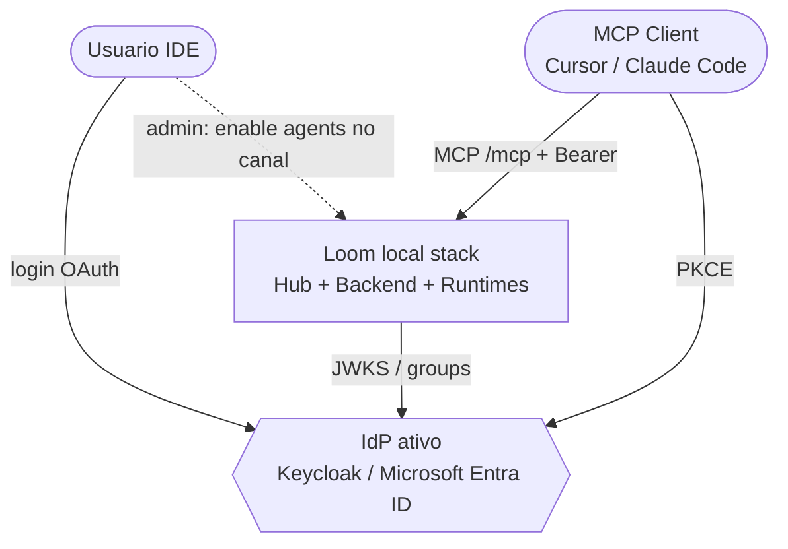
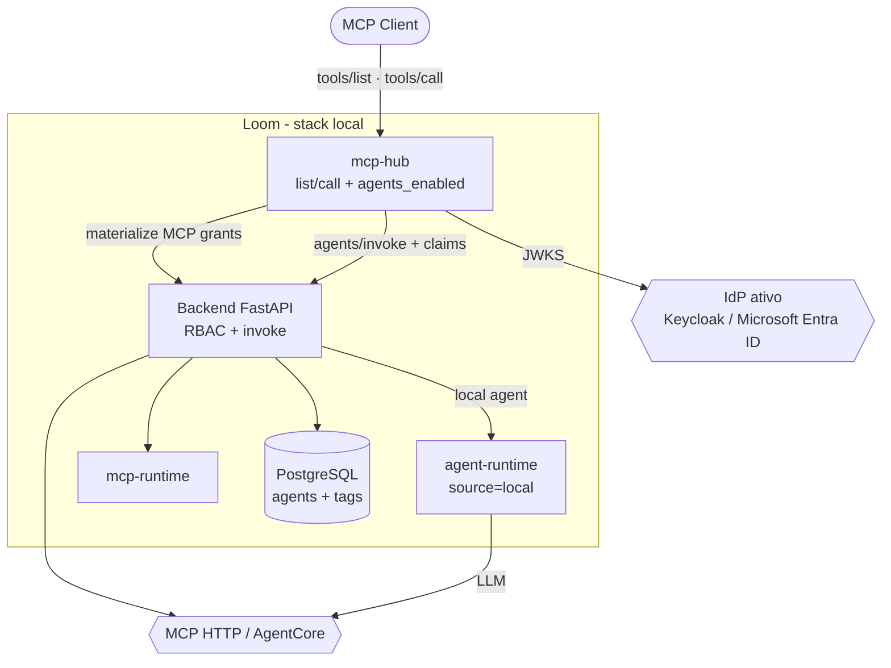
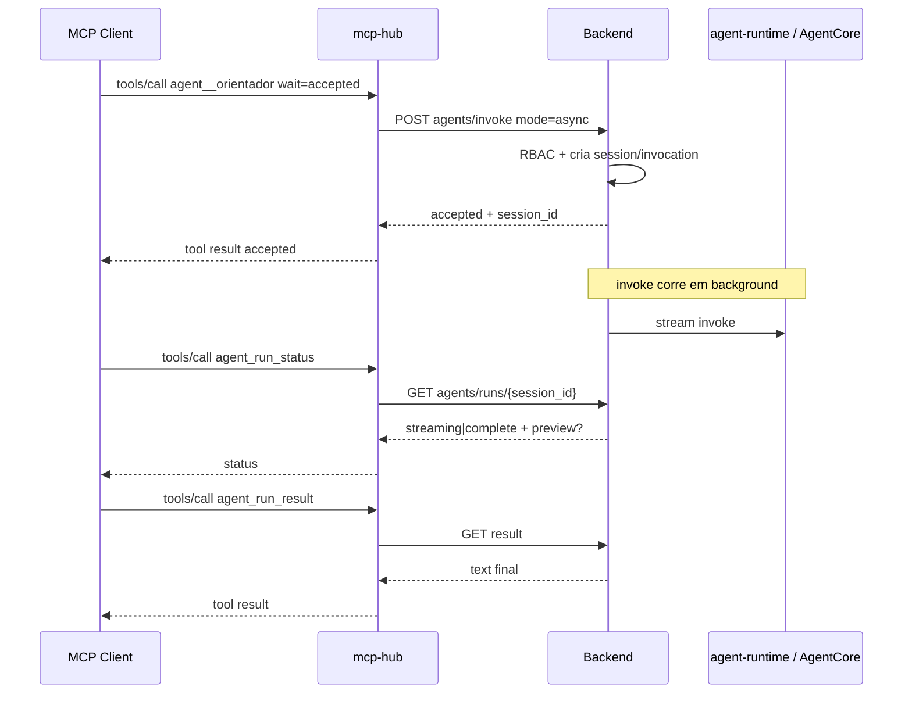

# 12. Agents Loom como tools MCP no Hub (Fase 2)

- **Status:** Aceito
- **Data:** 2026-09-14
- **Atualizado:** 2026-09-14 — run async + poll (prática de mercado)
- **Decisores:** Mantenedores da plataforma / extensão local
- **Relacionada a:**
  [ADR 0005 — Local Agent Runtime](0005-local-agent-runtime.md),
  [ADR 0007 — MCP Hub](0007-mcp-hub.md),
  [ADR 0008 — MCP Clients](0008-mcp-hub-clients.md),
  [ADR 0010 — Grants por perfil](0010-mcp-hub-profile-grants.md),
  [ADR 0011 — OAuth Hub](0011-mcp-hub-oauth-idp.md)
- **Complementa:** ADR 0007 §Fase 2 (invoke de agents via Hub)

## Problema

Com o Hub (Fase 1), o IDE já consome **tools MCP** governadas por canal ×
perfil ([ADR 0010](0010-mcp-hub-profile-grants.md)) e OAuth
([ADR 0011](0011-mcp-hub-oauth-idp.md)). Continua faltando acionar
**agents Loom** (ex. Orientador) a partir do mesmo MCP Client.

Não queremos:

1. protocolo A2A agora (sem consumidor A2A definido);
2. grants canal × perfil × agent (duplicariam o RBAC já expresso em
   `loom:group` no agent);
3. segundo catálogo de agents no Hub.

Queremos: no canal enabled, **opcionalmente** expor agents como tools
MCP; a lista/call respeita o **mesmo RBAC do Chat/invoke**.

## Decisão

### Modelo

```text
MCP Client (canal)
  status: discovered | enabled | disabled
  agents_enabled: bool   # default false — feature flag do canal
  grants[]: …            # só servers MCP (ADR 0010); NÃO agents

Agent (core Loom)
  tags.loom:group        # RBAC user→agent (já existente)
```

| Camada | Quem decide | Regra |
|--------|-------------|--------|
| Canal | Admin (plugin) | `agents_enabled` liga/desliga tools `agent__*` neste MCP Client |
| User → agent | Core Loom | `user_can_invoke_agent` + scope `invoke` (tags `loom:group` ↔ groups JWT) |
| User → MCP tools | Extensão | Profile grants (ADR 0010) — **inalterado** |

Não há matriz de grants de agent por perfil/canal. Dois users no mesmo
Cursor veem agents diferentes **só** porque os groups JWT diferem.

### Naming e shape das tools

**Por agent (discovery no IDE):**

- Nome: `agent__{slug}` (colisão → `agent__{slug}__{id}`). Sem `loom_`.
- Input: `{ "prompt": string, "session_id"?: string, "wait"?: "accepted" | "complete" }`.
  - Default `wait=accepted` (job async — prática de mercado).
  - `wait=complete` = atalho síncrono para agents curtos (timeout limitado).

**Correlação / monitoramento (sempre presentes se `agents_enabled`):**

| Tool | Papel |
|------|--------|
| `agent_run_status` | Poll: `{ session_id }` → status Loom (`pending`/`streaming`/`complete`/`error`) + trecho parcial opcional |
| `agent_run_result` | `{ session_id }` → texto final quando `complete`; 409 se ainda running |

Fonte de verdade = **InvocationSession / Invocation** do core (mesmo Chat).
Duração arbitrariamente longa: o IDE **não** precisa manter `tools/call`
aberto.

**Progress MCP (opcional, UX):** se `wait=complete` e a call ainda aberta,
Hub pode emitir `notifications/progress` enquanto consome SSE — complemento,
não substituto do poll.

### Resolução em `tools/list`

```text
1. JWT válido; canal bound (ADR 0009); client status = enabled
2. Materializar tools MCP via profile grants (ADR 0010)  → set A
3. Se agents_enabled:
     BFF lista agents invocáveis → set B = [ agent__slug … ]
     + tools fixas agent_run_status, agent_run_result
   senão B = []
4. tools/list = A ∪ B
```

### Resolução em `tools/call` (agent)

```text
agent__* (wait=accepted | default):
  POST BFF agents/invoke  { mode: "async" }
  → cria/reusa session; dispara invoke em background no BFF
  → tool result imediato: { status: "accepted", session_id, invocation_id }

agent__* (wait=complete):
  POST BFF agents/invoke  { mode: "sync", timeout_s }
  → buffer SSE até complete|timeout|error
  → tool result com texto (ou erro timeout + session_id para poll)

agent_run_status / agent_run_result:
  GET BFF agents/runs/{session_id}  (+ RBAC: subject dono da sessão)
```

Hub **não** executa LLM. Runtime e estado ficam no BFF / agent-runtime.

### Política de tags (alinhar ao invoke)

Reusar `user_can_invoke_agent` (`backend/app/services/mcp_hub.py`):

- `g-admins-super` → todos os agents;
- agent **sem** `loom:group` → permitido a quem tem `invoke`;
- caso contrário → short tag ∈ groups `g-users-*` / `g-admins-*` stripped.

Listagem no Hub **não** inventa regra diferente do invoke.

### UI (plugin Local runtime)

No editor do MCP Client (além de profile grants de servers):

- Toggle **Expose Loom agents** (`agents_enabled`).
- Opcional read-only: “Agents visíveis dependem do `loom:group` do user
  logado no IDE” (sem editor de grants de agent).

### Fronteira

| Extensão (`mcp-hub` + plugin) | Loom core |
|-------------------------------|-----------|
| Flag `agents_enabled` no store do client | RBAC tags + invoke + sessions |
| Prefix `agent__*` + status/result tools | `materialize-agents`, `agents/invoke`, `agents/runs/{id}` |
| Sem grants de agent | Dispatch async (default) / sync opcional |

## C4 — Contexto (L1)



## C4 — Containers (L2)



## C4 — Fluxo agent async (L3 lógico) — default



## Alternativas consideradas

| # | Opção | Resultado |
|---|--------|-----------|
| 1 | Grants canal × perfil × agent | **Rejeitada** — duplica `loom:group` |
| 2 | Sempre expor agents em todo client enabled | **Rejeitada** — admin precisa opt-in por canal (`agents_enabled`) |
| 3 | A2A gateway em vez de tools MCP | **Adiada** — sem consumidor A2A; IDE já é MCP |
| 4 | Hub chama agent-runtime direto | **Rejeitada** — BFF é autoridade de RBAC/secrets |
| 5 | Reusar `McpServerAccess` | **Rejeitada** — ACL agent→MCP, não user→agent |
| 6 | Tool única `invoke_agent` com `agent_id` | Possível; v1 prefere **uma tool por agent** (`agent__slug`) para discovery no IDE |
| 7 | Só buffer SSE síncrono (call aberta até o fim) | **Rejeitada como default** — timeout do IDE; não escala. Fica atalho `wait=complete` |
| 8 | Só progress notifications sem job id | **Rejeitada** — sem correlação se o socket cair |

## Consequências

- Specs [025](../specs/025-mcp-hub-agents-as-tools.md) (contrato) e
  atualizações em [016](../specs/016-mcp-hub-contract.md),
  [018](../specs/018-mcp-hub-allowlist.md),
  [021](../specs/021-mcp-hub-clients.md).
- ADR 0007 Fase 2 passa a apontar para esta ADR (não A2A por default).
- Store do MCP Client ganha `agents_enabled` (default `false`).
- Implementação **não** começa até 025 aceita.

## Specs

1. [025 — Agents como tools MCP](../specs/025-mcp-hub-agents-as-tools.md)
2. [016 — Contrato MCP](../specs/016-mcp-hub-contract.md)
3. [021 — MCP Clients](../specs/021-mcp-hub-clients.md)
