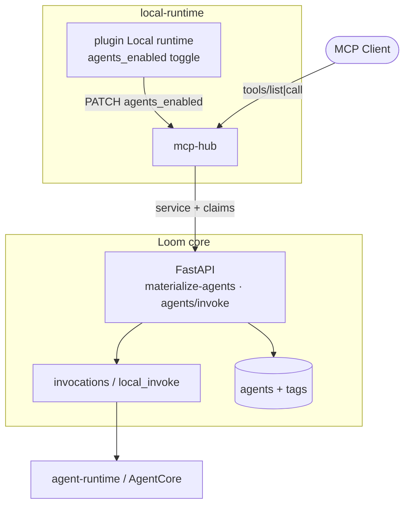
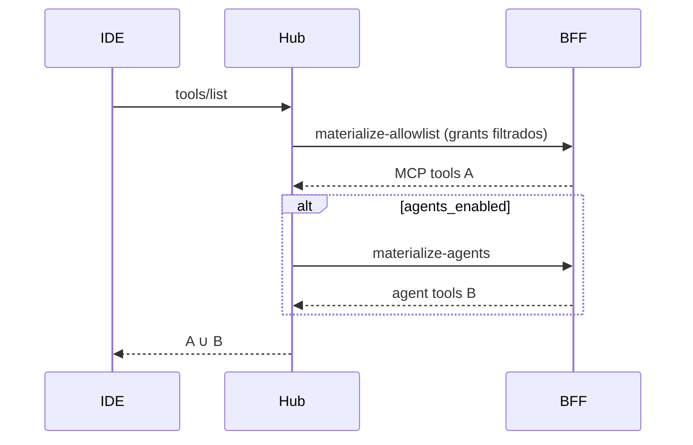

# Spec 025 — Agents Loom como tools MCP no Hub

- **Status:** Rascunho
- **Data:** 2026-09-14
- **Implementa:** [ADR 0012](../adr/0012-mcp-hub-agents-as-tools.md)
- **Depende de:**
  [016](016-mcp-hub-contract.md),
  [017](017-mcp-hub-session.md),
  [018](018-mcp-hub-allowlist.md),
  [021](021-mcp-hub-clients.md),
  [023](023-mcp-hub-profile-grants.md),
  [024](024-mcp-hub-oauth.md),
  [011](011-local-agent-runtime-contract.md)

## 1. Objetivo

Expor agents Loom como tools MCP no Hub **somente** quando:

1. o MCP Client (canal) está `enabled` **e** `agents_enabled=true`;
2. o user do JWT pode invocar o agent (RBAC `loom:group` + scope `invoke`).

Não criar grants de agent por canal/perfil. Profile grants (023) continuam
só para **servers MCP**.

## 2. Flag do canal

Campo no store do MCP Client (extensão):

```text
agents_enabled: boolean   # default false
```

| `status` | `agents_enabled` | Tools `agent__*` |
|----------|------------------|------------------|
| ≠ enabled | * | ausentes |
| enabled | false | ausentes |
| enabled | true | filtradas por RBAC |

API admin (Hub / proxy BFF):

```text
PATCH .../mcp-clients/{slug}
  { "agents_enabled": true | false }
```

(Ou campo no PUT de enable existente — detalhe de implementação livre desde
que o default seja `false`.)

## 3. Naming

| Campo | Regra |
|-------|--------|
| Prefixo | `agent__` (dois underscores) |
| Slug | lower-case; não alfanumérico → `-`; trim |
| Estável | preferir slug de `name` / runtime id; colisão → `agent__{slug}__{id}` |
| Proibido | prefixo `loom_` |

Exemplo: agent “Orientador Acadêmico” id=12 → `agent__orientador-academico`
(ou `agent__orientador-academico__12` se colidir).

## 4. Schema da tool

```text
name: agent__{slug}
description: <agent.description ou name>
inputSchema:
  type: object
  required: [prompt]
  properties:
    prompt:     { type: string }
    session_id: { type: string, description: "opcional; continua conversa" }
```

Resultado MCP (v1):

```text
{
  "content": [{ "type": "text", "text": "<resposta agregada>" }],
  "structuredContent": {
    "session_id": "...",
    "agent_id": 12,
    "status": "ok" | "error"
  }
}
```

`isError: true` se RBAC negar, agent inexistente, ou invoke falhar.

## 5. RBAC (core Loom)

Autoridade: mesma função do Chat — `user_can_invoke_agent(user, agent)` +
user deve ter scope `invoke` (derivado dos groups JWT via `GROUP_SCOPES`).

| Condição | Resultado |
|----------|-----------|
| `g-admins-super` | todos os agents ativos elegíveis |
| agent sem `loom:group` | permitido se `invoke` |
| `loom:group=demo` | user com `g-users-demo` ou `g-admins-demo` |
| sem match | agent **não** entra em `tools/list`; call → 403 / MCP error |

Vocabulário: tag short no agent; groups canônicos no JWT (strip
`g-users-` / `g-admins-`). **Não** usar short tag nos profile grants MCP.

## 6. BFF

Service auth: `MCP_HUB_SERVICE_TOKEN` (igual materialize/tools-call).
Claims: `subject` + `groups[]` (Hub confia no JWT; BFF **revalida** RBAC).

### 6.1 Materializar agents

```text
POST /api/mcp/hub/materialize-agents
Authorization: Bearer <service>
{
  "subject": "...",
  "groups": ["g-users-demo", "t-user"],
  "contract_version": "2026-09-hub-1"
}
→ 200 {
  "agents": [
    {
      "agent_id": 12,
      "slug": "orientador-academico",
      "exposed_name": "agent__orientador-academico",
      "name": "Orientador Acadêmico",
      "description": "...",
      "inputSchema": { ... }
    }
  ]
}
```

Só agents que passam RBAC + estão invocáveis (ex. `source=local` ready,
ou AgentCore/harness com endpoint; excluir soft-deleted / inactive).

### 6.2 Invoke

```text
POST /api/mcp/hub/agents/invoke
Authorization: Bearer <service>
{
  "subject": "...",
  "groups": ["g-users-demo"],
  "agent_id": 12,
  "prompt": "...",
  "session_id": null
}
→ 200 {
  "text": "...",
  "session_id": "...",
  "status": "ok"
}
→ 403 { "detail": "agent_forbidden" }
→ 404 { "detail": "agent_not_found" }
```

Implementação: rebuild `UserInfo` → checks → **reusar** caminho de
`invocations` (local_invoke / harness / AgentCore). Buffer de eventos SSE
até conclusão ou timeout (configurável; default alinhado ao Chat).

Hub **não** encaminha o stream SSE bruto ao IDE na v1 (tool result finito).

## 7. Hub runtime

### 7.1 `tools/list`

```text
A = tools MCP de profile grants (023 / 018)
B = [] 
if client.enabled and client.agents_enabled:
  B = materialize-agents(subject, groups) → exposed tools
return A ∪ B
```

### 7.2 `tools/call`

```text
if name.startswith("agent__"):
  if not client.agents_enabled: → erro
  resolve agent_id (mapa da última materialize / lookup BFF)
  POST agents/invoke
  mapear resposta → MCP tool result
else:
  caminho MCP server atual
```

## 8. UI

Local runtime → MCP Client selecionado:

1. Toggle **Expose Loom agents** (`agents_enabled`).
2. Texto de ajuda: visibilidade = `loom:group` do user OAuth no IDE.
3. Sem dropdown de perfil para agents; profile dropdown continua só para
   grants de **servers** (023).

## 9. Observabilidade

Logs / metrics mínimos (alinhar 020):

```text
hub_agents_list_count
hub_agent_invoke_total{agent_id,status}
hub_agent_invoke_latency_ms
```

Correlação: `subject`, `connection_id`, `mcp_client_slug`, `agent_id`.

## 10. Segurança

- Deny-by-default: `agents_enabled=false`.
- BFF revalida RBAC mesmo se o Hub errar o filtro.
- Service token nunca no IDE.
- Não aceitar `agent_id` arbitrário sem check de group.
- Timeout e tamanho máximo do texto agregado (evitar hang no IDE).
- Untagged agents: permitido com `invoke` (paridade Chat); documentar
  risco operacional (preferir sempre tagar).

## 11. C4 — Containers



## 12. C4 — Sequência list



## 13. Aceite

- [ ] Client `agents_enabled=false` → nenhum `agent__*` no list
- [ ] `g-users-demo` vê só agents `loom:group=demo` (+ untagged se política)
- [ ] `g-users-test` não chama agent `demo` (403)
- [ ] Call Orientador local → tool result com texto
- [ ] Tools MCP de servers inalteradas com toggle agents on/off
- [ ] Sem UI de grants de agent por perfil
- [ ] ADR 0012 + esta spec referenciados no README Hub

## 14. Fora de escopo (v1)

- Gateway A2A
- Stream MCP nativo da resposta do agent
- Grants canal × agent
- Auto-enable `agents_enabled` ao enable do client
